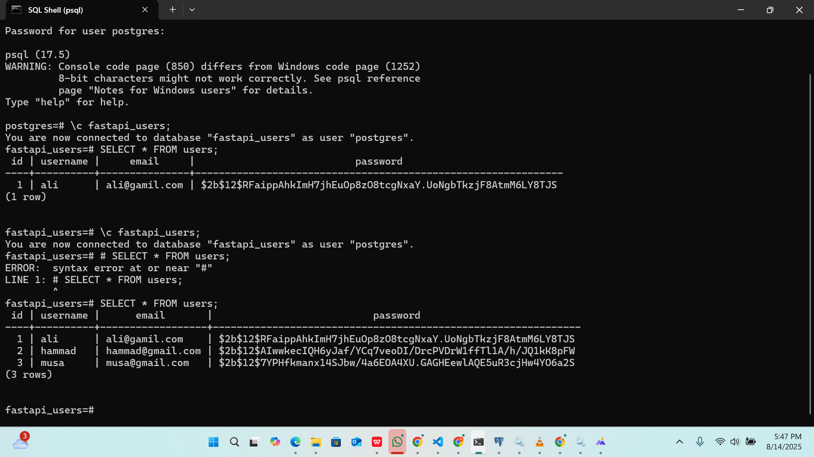

# FastAPI Weather & User Authentication API

##  Project Overview
This project is built using **FastAPI** and provides user authentication with JWT along with a weather forecast feature.  
It is designed to be simple, secure, and easy to extend.

### Features
- **User Signup:** `POST /signup` → Register a new user  
- **User Login:** `POST /login` → Login a user and get JWT token  
- **Weather Forecast:** `GET /weather?city=CityName` → Get a 7-day weather forecast for any city  
- **Root Endpoint:** `GET /` → Welcome message  

---

##  Project Structure
```
FastAPI-Weather-User-Authentication-API/  ← Root folder
│
├─ main.py           ← FastAPI main application
├─ auth.py           ← User signup/login endpoints
├─ weather.py        ← Weather endpoint
├─ models.py         ← SQLAlchemy models
├─ database.py       ← Database connection setup
├─ create_tables.py  ← Script to create database tables
├─ .env              ← Environment variables (DB credentials & API key)
├─ requirements.txt  ← Python dependencies
└─ README.md
```

---

##  Setup Instructions

### 1. Install Dependencies
```bash
pip install -r requirements.txt
```

### 2. Configure Environment Variables
Create a `.env` file in the root folder and add your database credentials and weather API key:
```
DB_HOST=localhost
DB_PORT=5432
DB_NAME=fastapi_users
DB_USER=postgres
DB_PASSWORD=YourPasswordHere
WEATHER_API_KEY=YourOpenWeatherMapAPIKey
```

> **Note:** `.env` file contains sensitive information. **Do not commit it to GitHub.**

### 3. Create Database Tables
```bash
python create_tables.py
```


### 4. Run FastAPI Server
```bash
uvicorn main:app --reload
```
Server will run at: [http://127.0.0.1:8000](http://127.0.0.1:8000)

---

##  Testing Endpoints

**Signup a User**
```bash
curl -X POST "http://127.0.0.1:8000/signup?username=ali&email=ali@test.com&password=123"
```

**Login User**
```bash
curl -X POST "http://127.0.0.1:8000/login?email=ali@test.com&password=123"
```

**Get Weather Forecast**
```bash
curl -X GET "http://127.0.0.1:8000/weather?city=Lahore"
```

**Verify Database Records**
```sql
SELECT * FROM users;
```

---

##  Notes
- Passwords are **hashed** for security.  
- Internet connection is required for the weather API.  
- Use the **same email** for login as used during signup.  
- `.env` file **must never** be committed to the repository.  

---

**Made with  using FastAPI**
